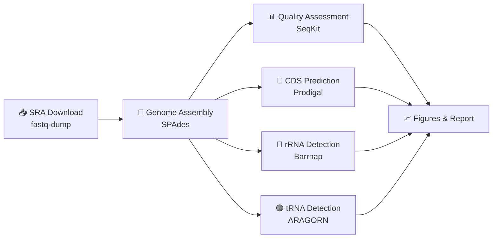

# 🧬 Genome Assembly & Annotation: De novo Assembly and Structural Annotation of SRR25083113


```
   ___    ___      _    _____    ___    __  ___  ___   __     __
  / _ \  / __\    /_\  /  __/   /_  )  / / / _ \/ _ ) / // /  / / __
 / // / / _\    / _ \/__ \    / __/  / / / // / _  |/ _  /  /_/_//
/____/ /_/     /_/ \_\___/   /____/ /_/ /____/____//_//_/  (_)\___\
```

**Ahmed Mohsin Ali¹**
¹Department of Computer Science, Jamia Millia Islamia, New Delhi, India

*"Reconstructing a genome's story, one contig at a time — built for machines that QUAST and Prokka left behind."*

A de novo bacterial genome assembly and structural annotation pipeline, purpose-built for **macOS ARM (Apple Silicon)**, where the classical QUAST/Prokka toolchain simply won't install.

---

## 📑 Table of Contents
- [Overview](#-overview)
- [The Pipeline at a Glance](#-the-pipeline-at-a-glance)
- [Dataset](#-dataset)
- [Key Results](#-key-results)
- [Repository Structure](#-repository-structure)
- [Requirements](#-requirements)
- [How to Run](#-how-to-run)
- [Citation](#-citation)
- [License](#-license)
- [Contact](#-contact)

---

## 🔬 Overview

This repository reconstructs the bacterial genome behind SRA accession **SRR25083113** — Illumina paired-end reads, assembled de novo with SPAdes, and structurally annotated for protein-coding genes, tRNAs, and rRNAs. No Prokka, no QUAST — just a modular ARM-native workflow that gets the same job done.

>  **Why this exists:** Prokka and QUAST don't run natively on Apple Silicon. Rather than fight the architecture, this pipeline swaps in SeqKit (QC) and a Prodigal + Barrnap + ARAGORN trio (annotation) — fully reproducible, fully ARM-compatible.

## 🗺️ The Pipeline at a Glance



## 🧫 Dataset

| Detail | Value |
|---|---|
| Source | NCBI SRA |
| Accession | SRR25083113 |
| Sequencing type | Illumina paired-end |
| Download tool | SRA Toolkit 3.2.1 (`fastq-dump`) |

## 📊 Key Results

### By the Numbers

| 🧩 Contigs | 📏 Genome Size | 🏔️ Largest Contig | 🧪 GC Content | 📐 N50 |
|---|---|---|---|---|
| **544** | **5.42 Mb** | **325,905 bp** | **50.46%** | **160,707 bp** |

### Genomic Feature Census

| Feature Type | Count |
|---|---|
| 🧬 Protein-coding genes (CDS) | 5,513 |
| 🔁 tRNA genes | 103 |
| 🧱 rRNA genes | 9 |

A complete, functionally diverse prokaryotic gene repertoire — despite the expected fragmentation that comes with short-read sequencing.

**Figures**

| Figure | What It Shows |
|---|---|
| `figures/Figure1_assembly_quality_summary.png` | Contig length distribution & GC vs. contig length |
| `figures/Figure2_cumulative_assembly_curve.png` | ~90% of the genome captured in the top 40 contigs |
| `figures/Figure3_genome_feature_composition.png` | CDS/tRNA/rRNA counts and proportions |
| `figures/Figure4_rRNA_feature_distribution.png` | 16S / 23S / 5S rRNA breakdown |
| `figures/Figure5_tRNA_distribution_across_contigs.png` | tRNA loci across the top 20 contigs, by amino acid |

## 📁 Repository Structure

```
srr25083113-genome-assembly-annotation/
├── scripts/
│   ├── 01_genome_assembly_pipeline.R
│   └── 02_generate_figures.R
├── figures/
├── tables/
│   ├── Table1_assembly_summary.csv
│   ├── Table2_annotation_summary.csv
│   └── Table3_example_annotated_genes.csv
├── output/
│   ├── contigs.fasta
│   ├── proteins.faa
│   ├── rRNAs.gff
│   └── tRNAs.txt
├── LICENSE
└── README.md
```

## ⚙️ Requirements

| Tool | Role |
|---|---|
| SRA Toolkit | Read download |
| SPAdes 4.2.0 | Assembly |
| SeqKit | Quality assessment (QUAST stand-in) |
| Prodigal | CDS prediction |
| Barrnap | rRNA detection |
| ARAGORN | tRNA detection |

```bash
conda install -c bioconda spades seqkit prodigal barrnap aragorn sra-tools
```

>  Built and battle-tested on macOS ARM (Apple Silicon).

## 🚀 How to Run

```bash
git clone https://github.com/amuhsenali/srr25083113-genome-assembly-annotation.git
cd srr25083113-genome-assembly-annotation

# In RStudio
source("scripts/01_genome_assembly_pipeline.R")
run_pipeline_interactive()

# Then generate the figures
setwd("SRR25083113_analysis")
source("../scripts/02_generate_figures.R")
```

## 📖 Citation

> Ali, A. M. (2026). *Genome Assembly & Annotation: De novo Assembly and Structural Annotation of SRR25083113 Bacterial Genome* [Computer software]. GitHub. https://github.com/amuhsenali/srr25083113-genome-assembly-annotation

## 📄 License

MIT License — see [`LICENSE`](./LICENSE).

## ✉️ Contact

**Ahmed Mohsin Ali**
